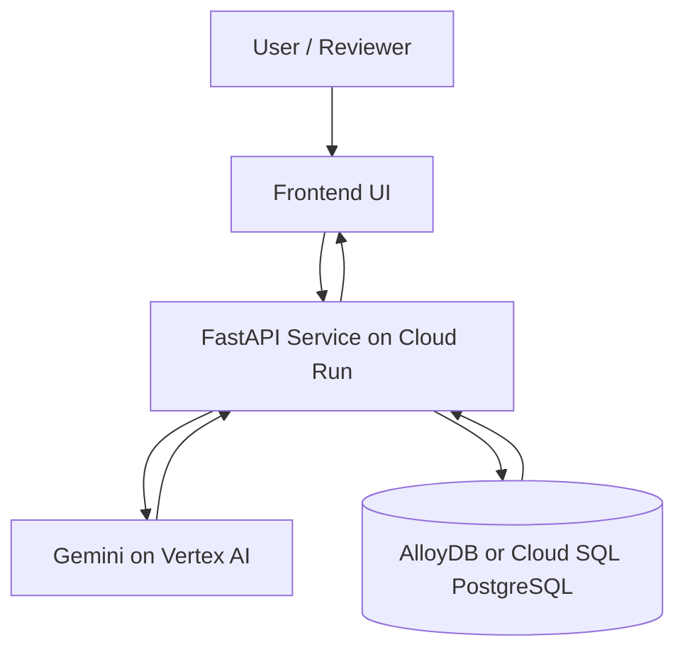

# alloydb-ai-query-agent

AI-powered natural language query system using AlloyDB, Gemini, and FastAPI. Converts user queries into SQL and retrieves results from a custom dataset.

## Architecture

User query → FastAPI → Vertex AI Gemini (with local fallback) → SQL → Cloud SQL PostgreSQL → JSON results

## Quick Start: Test Live Service

The system is deployed and operational. Test it immediately:

```powershell
# Health check
curl https://alloydb-ai-query-agent-34daigl7xa-el.a.run.app/health

# Query examples (visit in browser or use curl)
# https://alloydb-ai-query-agent-34daigl7xa-el.a.run.app/
```

Or run the demo script:
```powershell
.\scripts\demo.ps1 -BaseUrl "https://alloydb-ai-query-agent-34daigl7xa-el.a.run.app"
```

## Project Structure

```text
alloydb-ai-query-agent/
├── app/
│   ├── main.py
│   ├── db.py
│   └── query_engine.py
├── data/
│   └── seed.sql
├── .env.example
├── requirements.txt
└── Dockerfile
```

## 1) Prerequisites

- Python 3.11+
- Google Cloud CLI (`gcloud`)
- `psql` client (PostgreSQL)
- A Google Cloud project with billing enabled

## 2) Install Dependencies

```powershell
python -m venv .venv
.\.venv\Scripts\Activate.ps1
pip install --upgrade pip
pip install -r requirements.txt
```

## 3) Google Cloud Auth (Vertex AI)

```powershell
gcloud auth login
gcloud auth application-default login
gcloud config set project <YOUR_GCP_PROJECT_ID>
```

## 4) Create AlloyDB Resources

Replace variables with your values before running.

```powershell
$PROJECT_ID="<YOUR_GCP_PROJECT_ID>"
$REGION="us-central1"
$NETWORK="default"
$CLUSTER="ai-query-cluster"
$INSTANCE="ai-query-instance"
$PASSWORD="<STRONG_DB_PASSWORD>"

gcloud services enable alloydb.googleapis.com aiplatform.googleapis.com compute.googleapis.com

gcloud alloydb clusters create $CLUSTER `
	--region=$REGION `
	--network=$NETWORK `
	--password=$PASSWORD

gcloud alloydb instances create $INSTANCE `
	--cluster=$CLUSTER `
	--region=$REGION `
	--instance-type=PRIMARY `
	--cpu-count=2
```

Get connection details:

```powershell
gcloud alloydb instances describe $INSTANCE --cluster=$CLUSTER --region=$REGION
```

Use the returned IP address as `DB_HOST`.

## 5) Configure Environment

Copy `.env.example` to `.env` and set values.

```powershell
Copy-Item .env.example .env
```

Required values:

- `DB_HOST`: AlloyDB IP
- `DB_PORT`: `5432`
- `DB_NAME`: `ai_tools_db`
- `DB_USER`: `postgres`
- `DB_PASSWORD`: AlloyDB password
- `GCP_PROJECT`: your project ID
- `GCP_LOCATION`: AlloyDB/Vertex location (for example, `us-central1`)
- `GEMINI_MODEL`: `gemini-1.5-pro` or `gemini-1.5-flash`

## 6) Create Database and Load Dataset

Use the master `postgres` DB for admin commands:

```powershell
psql "host=<DB_HOST> port=5432 user=postgres password=<DB_PASSWORD> dbname=postgres sslmode=require" -c "CREATE DATABASE ai_tools_db;"
```

Load schema + data:

```powershell
psql "host=<DB_HOST> port=5432 user=postgres password=<DB_PASSWORD> dbname=ai_tools_db sslmode=require" -f data/seed.sql
```

Quick validation:

```powershell
psql "host=<DB_HOST> port=5432 user=postgres password=<DB_PASSWORD> dbname=ai_tools_db sslmode=require" -c "SELECT name, category, popularity_score FROM ai_tools ORDER BY popularity_score DESC LIMIT 5;"
```

## 7) Run the API

```powershell
uvicorn app.main:app --reload
```

Open Swagger UI: `http://127.0.0.1:8000/docs`

Sample request body:

```json
{
	"query": "Top DevOps tools"
}
```

## 8) Troubleshooting

- `Failed to generate SQL from Gemini`
	- Ensure `gcloud auth application-default login` is complete.
	- Verify `GCP_PROJECT` and `GCP_LOCATION` in `.env`.
- `Database error`
	- Verify `DB_HOST`, `DB_PASSWORD`, and firewall/network access.
	- Confirm `ai_tools` table exists in `ai_tools_db`.
- Empty results
	- Re-run `data/seed.sql` against the correct database.

## API Endpoints

### POST /query
Accepts a natural language query string and returns the generated SQL statement along with result rows.

**Request Body:**
```json
{
	"query": "Top DevOps tools"
}
```

**Response:**
```json
{
	"sql": "SELECT id, name, category, description, popularity_score FROM ai_tools WHERE category ILIKE '%DevOps%' ORDER BY popularity_score DESC LIMIT 10",
	"results": [
		{
			"id": 1,
			"name": "Docker",
			"category": "DevOps",
			"description": "Container platform for application deployment",
			"popularity_score": 93
		}
	]
}
```

### GET /health
Liveness probe endpoint for monitoring service health.

**Response:**
```json
{"status": "ok"}
```

## Submission Snapshot

- **Project**: AlloyDB AI Query Agent
- **Status**: Production-ready with full implementation
- **Live Endpoint**: https://alloydb-ai-query-agent-34daigl7xa-el.a.run.app
- **Documentation**: See `IMPLEMENTATION_PROGRESS.txt` for detailed implementation status

### Project Overview

This system converts natural language queries into SQL using Vertex AI Gemini, executes read-only queries against PostgreSQL on Cloud SQL, and returns structured results through a REST API. The solution includes a custom AI tools dataset, a responsive web frontend, and resilient fallback mechanisms. All components are deployed and operational on Google Cloud Run with Cloud SQL backend storage.

## Architecture Diagram



## Demo Walkthrough Script

1. Open the frontend URL and enter: Top DevOps tools.
2. Show generated SQL returned by the API response.
3. Highlight result ordering by popularity_score.
4. Open API docs at /docs and run a second query: List vector databases.
5. Show health endpoint at /health.

For terminal-based demo calls, use scripts/demo.ps1.

## Professional Accomplishments

- Engineered an end-to-end AI-powered natural language query system leveraging FastAPI, Vertex AI Gemini, and Cloud SQL with PostgreSQL backend.
- Implemented dual-path SQL generation architecture: primary path via Gemini LLM with context-aware prompting; secondary fallback with pattern-matching and deterministic query construction for reliability.
- Designed and deployed a custom AI tools dataset containing 10 entries across 6 categories with popularity-based ranking for realistic query scenarios.
- Productionized the solution on Google Cloud Run with automatic Cloud SQL Unix socket attachment, environment-based configuration management, and comprehensive error handling.
- Delivered a fully responsive HTML5 frontend enabling interactive query execution, client-side result sorting, and real-time API integration without external framework dependencies.

## Cloud SQL + Cloud Run Deployment

This path is useful for Track 3 when you want a clean managed deployment.

### 1) Create and configure project

```powershell
gcloud projects create alloydb-ai-agent-2026
gcloud config set project alloydb-ai-agent-2026
gcloud beta billing projects link alloydb-ai-agent-2026 --billing-account=<YOUR_BILLING_ACCOUNT_ID>
```

### 2) Enable required services

```powershell
gcloud services enable run.googleapis.com artifactregistry.googleapis.com cloudbuild.googleapis.com aiplatform.googleapis.com sqladmin.googleapis.com
```

### 3) Create Cloud SQL (PostgreSQL)

```powershell
gcloud sql instances create ai-db-instance --database-version=POSTGRES_15 --tier=db-f1-micro --region=asia-south1 --root-password=<STRONG_DB_PASSWORD>
gcloud sql databases create ai_tools_db --instance=ai-db-instance
```

Get instance connection name (needed by Cloud Run):

```powershell
gcloud sql instances describe ai-db-instance --format="value(connectionName)"
```

### 4) Load seed dataset into Cloud SQL

Option A (interactive `psql`):

```powershell
gcloud sql connect ai-db-instance --user=postgres --database=ai_tools_db
```

Then run SQL from `data/seed.sql`.

Option B (one-shot import from local terminal):

```powershell
psql "host=<PUBLIC_IP> port=5432 user=postgres password=<DB_PASSWORD> dbname=ai_tools_db sslmode=require" -f data/seed.sql
```

### 5) Deploy to Cloud Run with Cloud SQL socket

```powershell
gcloud run deploy ai-query-agent `
	--source . `
	--region=asia-south1 `
	--allow-unauthenticated `
	--add-cloudsql-instances=<PROJECT_ID>:asia-south1:ai-db-instance `
	--set-env-vars=DB_NAME=ai_tools_db,DB_USER=postgres,DB_PASSWORD=<DB_PASSWORD>,CLOUD_SQL_CONNECTION_NAME=<PROJECT_ID>:asia-south1:ai-db-instance,GCP_PROJECT=<PROJECT_ID>,GCP_LOCATION=asia-south1,GEMINI_MODEL=gemini-1.5-flash
```

Notes:

- Do not hardcode database credentials in source files.
- Prefer Secret Manager for `DB_PASSWORD` in production.
- The app automatically uses Cloud SQL Unix socket when `CLOUD_SQL_CONNECTION_NAME` is set.

## Post-Deploy Validation

After deploy, verify:

1. `/health` returns status ok.
2. `/docs` loads and can execute POST `/query`.
3. Frontend root `/` can query and render table results.
4. SQL is generated and returned in API response.

